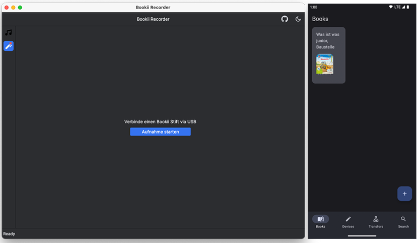
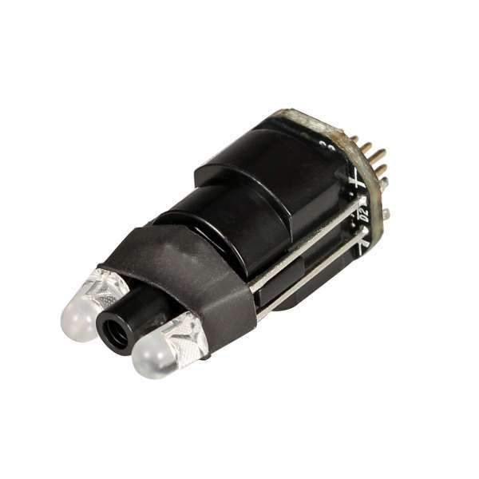

# Recorder for Bookii

[](https://github.com/thebino/BookiiRecorder/actions/workflows/continuous-delivery-pipeline.yml)

<a href='https://play.google.com/store/apps/details?id=pro.stuermer.bookii'></a>

Unofficial app to record and transfer audio records to a bookii pen. Build creative and truly custom books for the little ones by adding speech or and custom audio content. Like for un-supported books. 

> Publishing or selling self-created products without permission, might violate the copyright of Tesslof or one of its partners! 



# 🌱 Features

 * Record custom audio tracks
 * Create books to group recordings
 * Transfer Books or single records to and from a connected device


# 🧪 Technology

This project is realized with [Kotlin Multiplatform](https://kotlinlang.org/docs/multiplatform.html) and currently supports

 * Android
 * macOS
 * Windows

The implementation is using the following tech stack

 * [Compose Multiplatform](https://www.jetbrains.com/lp/compose-mpp/) as UI layer
 * [JetBrains Jewel](https://github.com/JetBrains/jewel) as UI theme
 * [SQLDelight](https://cashapp.github.io/sqldelight/multiplatform_sqlite/) as database
 * [Ktor](https://github.com/ktorio/ktor) as async web framework
 * [Okio](https://square.github.io/okio/) as wrapper for I/O


# 💻 Build

To build and run the desktop app

```shell
$ ./gradlew :app-desktop:run
```

To build and run the android app (emulator or real android device is needed)

```shell
$ ./gradlew :app-android:installDebug
```


# 👨🔬 Engineering

A Bookii Pen device is build for children by [Tessloff](https://kinder-jugendbuch-verlage.de/de/verlage/tessloff-verlag/)
Underneath the hardware is build on a [Sonix OID3 SN9P702BFG](https://www.sonix.com.tw/article-en-1686-29170) OID Decoder to identify patterns of black squares.

By holding the device close to an OID supported book, paper or sticker the CMOS-Sensor in the device will scan the pattern and converts it to a [OID](https://www.sonix.com.tw/category-en-956)  



## ⚖️ License

    Copyright 2022 Stürmer, Benjamin

    Licensed under the Apache License, Version 2.0 (the "License");
    you may not use this file except in compliance with the License.
    You may obtain a copy of the License at

       https://www.apache.org/licenses/LICENSE-2.0

    Unless required by applicable law or agreed to in writing, software
    distributed under the License is distributed on an "AS IS" BASIS,
    WITHOUT WARRANTIES OR CONDITIONS OF ANY KIND, either express or implied.
    See the License for the specific language governing permissions and
    limitations under the License.
